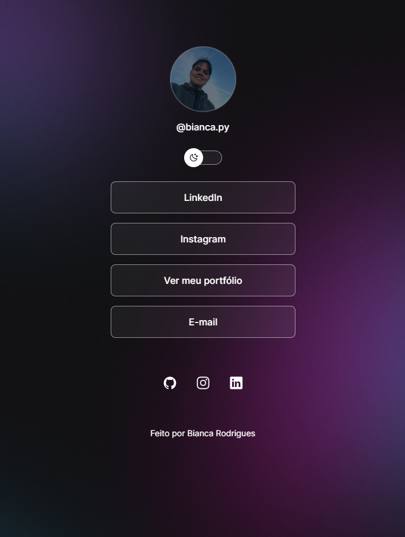

<h1 align="center">DevLinks</h1>

Programa exclusivo e gratuito, promovido pela Rocketseat para o ensino de tecnologias WEB

## 🚀Tecnologias

Esse projeto foi desenvolvido com as seguintes tecnologias:

- HTML e CSS
- JavaScript
- Git e Github
- Figma

## 💻Projeto

O DevLinks é um agregador de links para usar como cartão de visitas online.

## 📋Layout

Você pode visualizar o layout do projeto através [DESSE LINK](https://www.figma.com/community/file/1187422022288947321)

É necessário ter uma conta no [Figma](https://www.figma.com/)

## 📝 Licença

Esse projeto está sob a licença MIT
